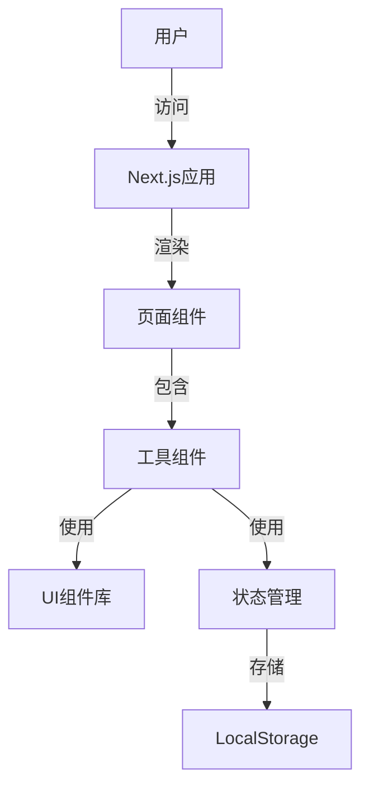

# 设计文档

## 概述

本文档详细描述了榴莲工具（工具聚合型网站）的设计方案。该网站将提供多种实用工具，包括待办事项管理、JSON格式对比和JWT解析等功能，采用现代化UI设计，提供良好的用户体验，并具有可扩展性。

## 架构

网站将采用基于Next.js的前端架构，使用Tailwind CSS进行样式设计，并集成shadcn/ui组件库以提供现代化的UI元素。

### 技术栈

- **前端框架**：Next.js
- **包管理**: pnpm
- **Nodejs版本**: 20.16.0
- **样式解决方案**：Tailwind CSS
- **UI组件库**：shadcn/ui
- **图标库**：FontAwesome
- **状态管理**：React Context API / Zustand（根据复杂度选择）
- **数据持久化**：LocalStorage（客户端存储）

### 系统架构图



## 组件和接口

### 核心组件

1. **Layout组件**
   - 负责整体页面布局
   - 包含导航菜单和内容区域
   - 处理响应式设计

2. **ToolCard组件**
   - 在首页展示每个工具的卡片
   - 包含工具图标、名称和简短描述
   - 处理点击导航事件

3. **工具特定组件**
   - TodoApp：待办事项管理工具
   - JsonCompare：JSON格式对比工具
   - JwtDecoder：JWT解析工具

### 页面结构

1. **首页（index.html）**
   - 工具导航菜单
   - iframe容器，用于展示各工具页面
   - 页脚信息

2. **工具页面**
   - todo.html：待办事项管理工具页面
   - json.html：JSON格式对比工具页面
   - jwt.html：JWT解析工具页面

### 组件接口

#### TodoApp组件

```typescript
interface TodoItem {
  id: string;
  text: string;
  completed: boolean;
  createdAt: Date;
}

interface TodoAppProps {
  initialTodos?: TodoItem[];
  onSave?: (todos: TodoItem[]) => void;
}
```

#### JsonCompare组件

```typescript
interface JsonCompareProps {
  initialLeftJson?: string;
  initialRightJson?: string;
  onCompare?: (diff: any) => void;
}
```

#### JwtDecoder组件

```typescript
interface JwtDecoderProps {
  initialToken?: string;
  onDecode?: (decoded: {
    header: any;
    payload: any;
    signature: string;
    isExpired: boolean;
  }) => void;
}
```

## 数据模型

### 待办事项数据模型

```typescript
interface TodoItem {
  id: string;         // 唯一标识符
  text: string;       // 待办事项内容
  completed: boolean; // 完成状态
  createdAt: Date;    // 创建时间
}
```

### JSON对比数据模型

```typescript
interface JsonCompareData {
  leftJson: string;   // 左侧JSON文本
  rightJson: string;  // 右侧JSON文本
  diffResult: any;    // 对比结果
}
```

### JWT解析数据模型

```typescript
interface JwtData {
  token: string;      // JWT令牌
  header: any;        // 解析后的头部
  payload: any;       // 解析后的载荷
  signature: string;  // 签名部分
  isExpired: boolean; // 是否已过期
}
```

## 错误处理

### 错误类型

1. **输入验证错误**
   - JSON格式无效
   - JWT令牌格式无效
   - 输入为空

2. **处理错误**
   - JSON解析失败
   - JWT解码失败

3. **存储错误**
   - LocalStorage访问失败

### 错误处理策略

- 使用try-catch块捕获并处理错误
- 显示用户友好的错误消息
- 提供错误恢复建议
- 记录错误信息（仅开发环境）

## 用户界面设计

### 设计原则

- **简洁明了**：界面简洁，功能明确
- **一致性**：所有工具保持一致的设计语言
- **响应式**：适应不同屏幕尺寸
- **可访问性**：符合WCAG 2.1 AA级标准
- **即时反馈**：用户操作后提供明确反馈

### 色彩方案

- **主色**：#3B82F6（蓝色）
- **辅助色**：#10B981（绿色）、#EF4444（红色）
- **中性色**：#1F2937（深灰）、#F3F4F6（浅灰）
- **背景色**：#FFFFFF（白色）、#F9FAFB（超浅灰）

### 排版

- **主标题**：Inter, 24px, 700 weight
- **副标题**：Inter, 18px, 600 weight
- **正文**：Inter, 16px, 400 weight
- **小文本**：Inter, 14px, 400 weight

### 布局

1. **桌面布局**
   - 左侧固定导航栏（宽度250px）
   - 右侧内容区域（自适应宽度）
   - 工具内容居中显示（最大宽度1200px）

2. **移动布局**
   - 顶部导航栏（可折叠）
   - 全宽内容区域
   - 底部导航菜单

### 交互设计

- 点击工具卡片或导航项加载相应工具
- 表单提交使用按钮点击或回车键
- 提供加载状态指示器
- 操作成功后显示成功提示
- 错误发生时显示错误提示

## 页面原型设计

### 首页设计

首页将展示所有可用工具的卡片，用户可以点击卡片进入相应工具页面。

```
+-----------------------------------------------+
|  榴莲工具                         主题 🌙  |
+-----------------------------------------------+
|                                               |
|   +-------------+  +-------------+            |
|   | ✓           |  | { }         |            |
|   | 待办事项     |  | JSON对比    |            |
|   |             |  |             |            |
|   +-------------+  +-------------+            |
|                                               |
|   +-------------+  +-------------+            |
|   | 🔑          |  | +           |            |
|   | JWT解析     |  | 更多工具     |            |
|   |             |  | 即将推出     |            |
|   +-------------+  +-------------+            |
|                                               |
+-----------------------------------------------+
|  榴莲工具© 2025 工具聚合网站                          |
+-----------------------------------------------+
```

### 待办事项工具设计

```
+-----------------------------------------------+
|  榴莲工具 > 待办事项                 主题 🌙  |
+-----------------------------------------------+
|                                               |
|  新建待办事项                                  |
|  +-----------------------------------+  [添加]  |
|  |                                   |        |
|  +-----------------------------------+        |
|                                               |
|  [ ] 完成网站设计                              |
|  [ ] 实现JSON对比功能                          |
|  [ ] 添加JWT解析工具                           |
|  [x] 创建项目规划                              |
|                                               |
|  已完成: 1   待完成: 3                         |
|                                               |
+-----------------------------------------------+
```

### JSON对比工具设计

```
+-----------------------------------------------+
|  榴莲工具 > JSON对比                  主题 🌙  |
+-----------------------------------------------+
|                                               |
|  左侧JSON                   右侧JSON           |
|  +------------------+      +------------------+|
|  |{                 |      |{                 ||
|  |  "name": "工具网站"|      |  "name": "工具网站"||
|  |  "version": "1.0"|      |  "version": "1.1"||
|  |  "tools": [      |      |  "tools": [      ||
|  |    "todo",       |      |    "todo",       ||
|  |    "json"        |      |    "json",       ||
|  |  ]               |      |    "jwt"         ||
|  |}                 |      |  ]               ||
|  |                  |      |}                 ||
|  +------------------+      +------------------+|
|                                               |
|  [对比结果]                                    |
|  +-------------------------------------------+|
|  | - version: "1.0" → "1.1"                  ||
|  | - tools[2]: undefined → "jwt"             ||
|  +-------------------------------------------+|
|                                               |
+-----------------------------------------------+
```

### JWT解析工具设计

```
+-----------------------------------------------+
|  榴莲工具 > JWT解析                   主题 🌙  |
+-----------------------------------------------+
|                                               |
|  JWT令牌                                      |
|  +-------------------------------------------+|
|  | eyJhbGciOiJIUzI1NiIsInR5cCI6IkpXVCJ9...   ||
|  +-------------------------------------------+|
|                                               |
|  [解析]                                       |
|                                               |
|  解析结果                                      |
|  +-------------------------------------------+|
|  | 头部 (Header):                             ||
|  | {                                         ||
|  |   "alg": "HS256",                         ||
|  |   "typ": "JWT"                            ||
|  | }                                         ||
|  |                                           ||
|  | 载荷 (Payload):                           ||
|  | {                                         ||
|  |   "sub": "1234567890",                    ||
|  |   "name": "工具网站用户",                   ||
|  |   "iat": 1516239022                       ||
|  | }                                         ||
|  |                                           ||
|  | 签名 (Signature):                         ||
|  | HMACSHA256(base64UrlEncode(header) + "." +||
|  | base64UrlEncode(payload), secret)         ||
|  +-------------------------------------------+|
|                                               |
+-----------------------------------------------+
```

## 实现计划

1. 搭建Next.js项目基础结构
2. 实现核心布局和导航组件
3. 实现待办事项工具
4. 实现JSON对比工具
5. 实现JWT解析工具
6. 优化用户界面和交互体验
7. 进行测试和修复问题
8. 部署和发布